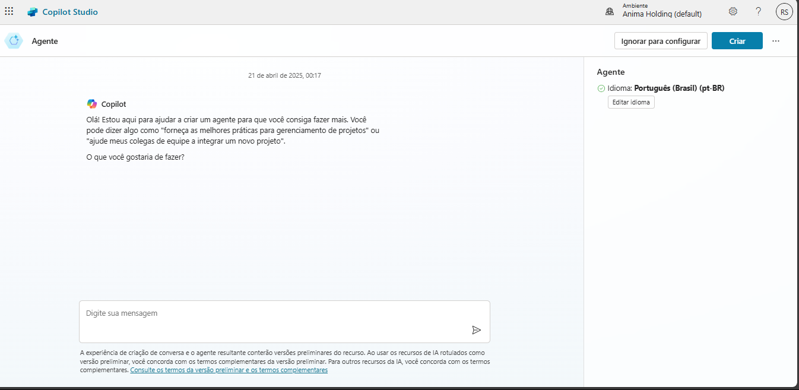
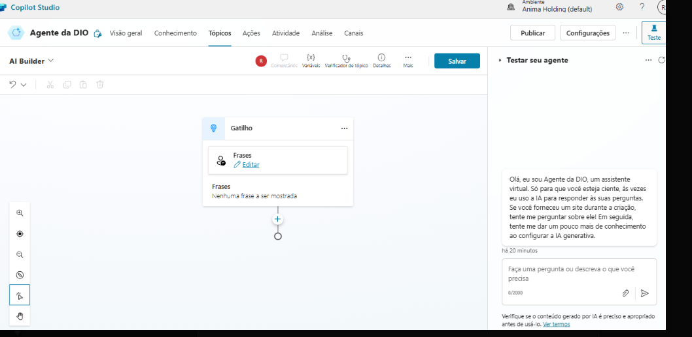
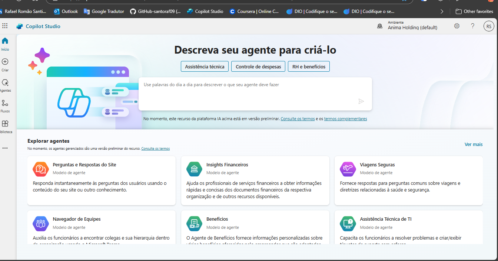
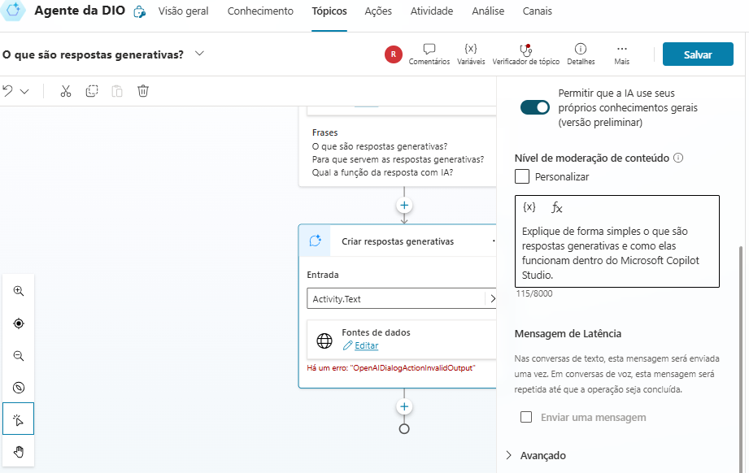

# 🤖 Copiloto com Fluxo de Conversa Personalizado no Microsoft Copilot Studio

Projeto criado como parte do desafio da plataforma DIO. O objetivo foi desenvolver um copiloto com fluxo de conversa personalizado, utilizando IA generativa.

---

## ✅ Funcionalidades Implementadas

- Criação de um agente com identidade própria
- Desenvolvimento de múltiplos tópicos personalizados
- Uso de respostas generativas com IA
- Personalização da mensagem de erro
- Testes de funcionamento dentro do ambiente do Copilot Studio

---

## 📸 Capturas de Tela do Projeto

### 1. Criação do Agente no Copilot Studio

### 2. Edição dos Tópicos e Gatilhos

### 3. Configuração das Respostas Generativas

### 4. Teste do Copiloto no ambiente do Studio

### 5. Personalização da Mensagem de Erro

---

## 📁 Como Executar

1. Acesse o [Microsoft Copilot Studio](https://copilotstudio.microsoft.com/)
2. Crie um novo agente com base no conteúdo demonstrado
3. Configure os tópicos conforme o fluxo apresentado
4. Teste seu copiloto e publique!

